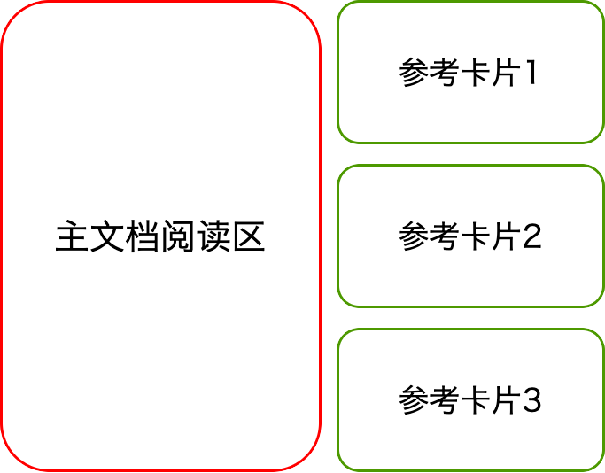
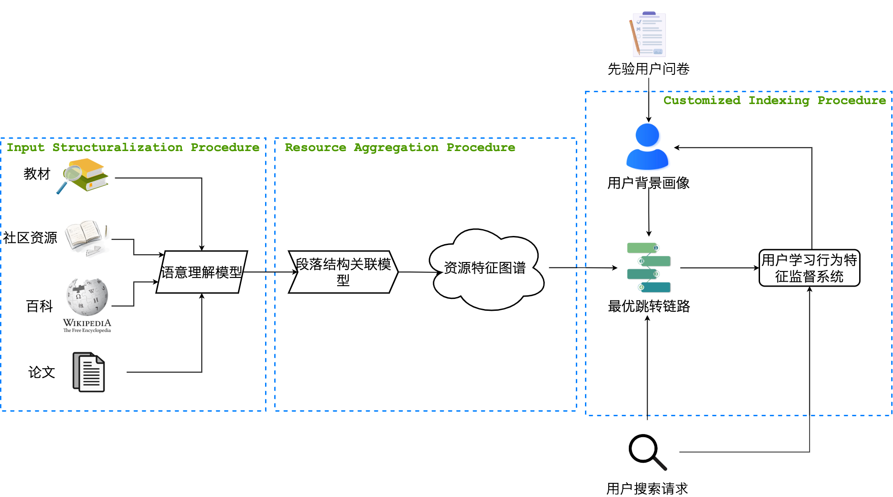

# 树蛙 - 为您带来最流畅的学术阅读体验

[项目仓库](https://github.com/gonggongjohn/CKAS) | [介绍网站](https://gonggongjohn.github.io/ckas-website/)

---

## 阅读教材时的痛点
  - “检索定位很麻烦”：对知识点不熟悉，来回翻看影响阅读体验
  - “知识碎片化”：书籍、博客等资料丰富却未整合，知识分散在多本书里
  - “不成知识体系”：想要快速掌握某一知识点，不知要补哪些基础知识
  - “教材缺乏个性化”：传统教材千人一面，不针对用户的背景和兴趣

---

## 阅读学术文章时的痛点
- “专有名词不了解”：跨学科、新兴学科文献阅读时遇到障碍
- “文献管理和引用定位功能不佳”：大量文献翻找起来很麻烦
- “背景知识学得慢”：想快速掌握某个知识点，却看了很多次要信息

---

## 我们能做什么
根据您的知识背景，个性化定制您的阅读体验
- 模糊知识点快速索引
- 根据您的知识背景智能呈现参考资源
- 快速索引专业术语定义和例子
- 文献引用精准定位到句子

---

## 高效理解？只需要三步！

- 选择一本您想要学习的教材（学术文章）
- 自由阅读
- 不理解某个术语/段落？点击它！

---

## 分屏显示，阅读体验不间断
##### 阅读界面自动区分主次显示区，参考资源渐进式推送，使您不再因翻阅其他资料而打断阅读点。

---

## 系统构架

##### 我们是如何实现这一系统的？

---

## 技术细节

- 文本检测 & 文字识别
- 词法分析 & 语义关联
- 用户画像 & 特征选择
- 知识图谱 & 推荐系统

---

# 了解更多？

订阅我们的Github仓库，追踪项目最新讯息！

[项目仓库](https://github.com/gonggongjohn/CKAS)
